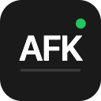

<p align="center">
  
</p>

<h1 align="center">
  
  AFK Host
</h1>

<p align="center">
  <strong>Remote desktop host for <a href="https://afkdev.app">AFK</a></strong><br>
  Stream your Mac or Windows screen to your phone and control it with touch and voice.
</p>

<p align="center">
  <a href="https://afkdev.app">Website</a> •
  <a href="https://apps.apple.com/app/afk-remote/id6756719961">App Store</a> •
  <a href="https://play.google.com/store/apps/details?id=app.afkdev.afk">Google Play</a> •
  <a href="https://afkdev.app/download">Download</a>
</p>

---

## What is AFK?

AFK is a remote desktop app designed for **vibe coding** — directing AI agents like Claude Code from your phone using voice commands while lounging on your couch.

This repo contains the **host application** that runs on your computer and streams your screen to the AFK mobile app.

## Features

- 🖥️ **Low-latency Streaming** — WebRTC-powered screen sharing with adaptive quality
- 🎤 **Voice Control** — Speak commands to control your computer
- 🖱️ **Touch Input** — Full mouse and keyboard control from your phone
- 🪟 **Window Switcher** — Quickly switch between windows with touch
- 🔔 **CLI Notifications** — Get notified when Claude Code or Pi needs attention
- 🔒 **End-to-End Encryption** — Secure connection between devices

## Supported Platforms

| Platform | Status |
|----------|--------|
| macOS | ✅ Stable |
| Windows | 🚧 In development |
| Linux | 💭 Planned |

## Quick Start

1. **Download** the host app from [afkdev.app/download](https://afkdev.app/download)
2. **Install** and grant screen recording permission when prompted
3. **Get the mobile app** on [iOS](https://apps.apple.com/app/afk-remote/id6756719961) or [Android](https://play.google.com/store/apps/details?id=app.afkdev.afk)
4. **Pair** by entering the 6-digit code shown on your computer

For detailed setup instructions, visit [afkdev.app](https://afkdev.app).

## Build from Source

Requires [Flutter](https://flutter.dev/docs/get-started/install) 3.10+

```bash
# Clone the repo
git clone https://github.com/liboshen/afk-host.git
cd afk-host

# Install dependencies
flutter pub get

# Run
flutter run -d macos    # macOS
flutter run -d windows  # Windows (rough edges)

# Build release
flutter build macos
flutter build windows
```

## License

MIT License — see [LICENSE](LICENSE) for details.

---

<p align="center">
  <a href="https://afkdev.app">afkdev.app</a>
</p>
